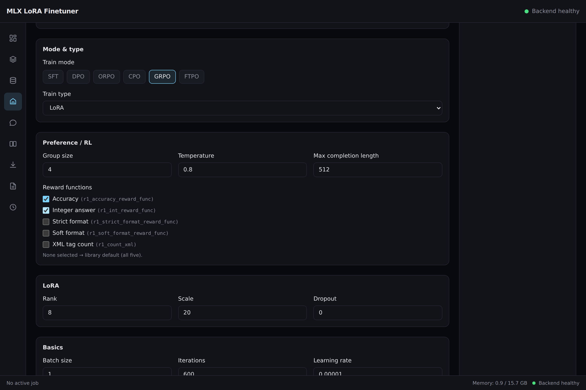

# mlx-lora-finetuner

[](https://github.com/aykutcayir34/mlx-lora-finetuner/actions/workflows/ci.yml)
[](LICENSE)
[](https://www.python.org/)
[](https://nodejs.org/)

A local web studio for LoRA fine-tuning of LLMs on Apple Silicon, built on top of
[mlx-lm-lora](https://github.com/Goekdeniz-Guelmez/mlx-lm-lora). FastAPI backend +
React/TypeScript/Vite frontend, similar in spirit to Unsloth Studio but running
entirely on-device via MLX — no cloud GPUs, no data leaving your Mac.


To try it yourself: `make run` builds the frontend and serves the whole app
from a single process on http://127.0.0.1:8000 (see
[Production / single-command run](#production--single-command-run)).

## Features

- **Models** — search and download models from the Hugging Face Hub (defaults to
  the `mlx-community` org), track downloads live, browse and delete local models.
- **Datasets** — upload JSONL files with automatic format detection across 6
  supported formats (`chat`, `completions`, `text`, `dpo`, `orpo`, `grpo`), per-row
  validation with errors/warnings, train/valid/test splitting, and a paginated
  preview per split.
- **Train** — SFT, DPO, ORPO, CPO, GRPO, and FTPO training modes, LoRA/DoRA/full
  fine-tuning, QLoRA-style 4/6/8-bit quantized loading, and a live run monitor
  with loss/learning-rate/memory charts and a log tail streamed over
  WebSocket.
- **Chat** — streaming chat against a base model or a trained LoRA adapter, with
  a side-by-side adapter-compare mode to see how fine-tuning changed responses.
- **Arena** — side-by-side comparison of two model/adapter pairs against the
  same prompt, generated sequentially over a single WebSocket (one Metal GPU,
  one model resident at a time).
- **Data Recipes** — deterministic, no-LLM document→dataset conversion:
  upload a `.pdf`/`.docx`/`.txt`/`.md` and get a chunked `text` dataset, or a
  `.csv` and get a `completions`/`chat` dataset — registered like any other
  upload once the conversion job completes.
- **Run History** — a filterable, sortable history of every run (by model,
  train mode, status) with one-click cloning of a past run's config into a
  fresh prefill.
- **Export** — fuse a LoRA adapter into the base model, convert the fused model to
  GGUF (with preflight checks for llama.cpp availability, architecture support,
  and de-quantization), and render an Ollama `Modelfile` ready for `ollama create`.
- **Dashboard** — system stats (memory/disk), the active run at a glance, recent
  runs, and an onboarding guide for first-time setup.

## Requirements

- Apple Silicon Mac (training and chat inference run through MLX / Metal).
- Python 3.11+ with [uv](https://docs.astral.sh/uv/).
- Node.js 20+ with npm.

The backend also runs on Linux/CI *without* MLX installed for everything except
actual training/inference (see [Development](#development) below) — that's how
this project's own CI works.

## Quickstart

```bash
make install   # uv sync (backend) + npm install (frontend)
make dev       # backend on :8000, frontend on :5173
```

Open http://localhost:5173. The backend also serves interactive API docs at
http://localhost:8000/docs.

## Production / single-command run

Build the frontend once, then serve API + UI from a single FastAPI process:

```bash
make run       # = make build, then `cd backend && uv run mlxlf`
```

`mlxlf` starts uvicorn on http://127.0.0.1:8000 (serving the built frontend
from `frontend/dist`) and opens it in your default browser. Flags:

```bash
cd backend && uv run mlxlf --host 0.0.0.0 --port 9000 --no-browser
```

If the frontend build is missing, `mlxlf` still starts but serves the API
only (it prints a hint to run `make build`). Set `MLXLF_STATIC_DIR` to serve
a build from a non-default location.

## Example: GRPO fine-tuning end to end

GRPO (group relative policy optimization) trains a model against *reward
functions* instead of fixed target answers: for every prompt the model samples
a group of completions, each one is scored, and completions that score above
their group's average are reinforced. This walkthrough teaches a small model
to reason step by step and put its final answer inside `<answer></answer>`
tags — the exact convention the built-in `r1_*` reward functions score.



**1. Prepare a dataset.** GRPO uses the `grpo` format: one JSON object per
line with a `prompt`, the ground-truth `answer`, and an optional `system`
message. Save something like this as `math.jsonl` (a real dataset should have
a few hundred rows; keep answers short and objectively checkable):

```jsonl
{"system": "You are a careful math tutor. Think step by step, then give the final answer inside <answer></answer> tags.", "prompt": "What is 47 + 38?", "answer": "85"}
{"system": "You are a careful math tutor. Think step by step, then give the final answer inside <answer></answer> tags.", "prompt": "What is 72 - 29?", "answer": "43"}
{"system": "You are a careful math tutor. Think step by step, then give the final answer inside <answer></answer> tags.", "prompt": "What is 16 * 24?", "answer": "384"}
```

**2. Upload and split.** On the **Datasets** page, drop `math.jsonl` — the
format is auto-detected as `grpo`. Then use **Split** (e.g. 80/10/10) so the
trainer gets its `train`/`valid` files.

**3. Download a model.** On the **Models** page, search and download a small
instruct model, e.g. `mlx-community/Qwen2.5-0.5B-Instruct-4bit` — small
enough to iterate quickly on any Apple Silicon Mac.

**4. Configure the run.** On the **Train** page pick the model and dataset
(only `grpo`-format datasets are selectable in GRPO mode), then:

- **Train mode**: `GRPO` — **Group size**: `4` is a good start (completions
  sampled per prompt; higher = better reward signal, more memory).
- **Temperature** `0.8` keeps the sampled groups diverse; **Max completion
  length** bounds each sample.
- **Reward functions** — the five built-ins from mlx-lm-lora, combinable:
  - `r1_accuracy_reward_func` — extracted `<answer>` exactly matches the target
  - `r1_int_reward_func` — the extracted answer is an integer
  - `r1_strict_format_reward_func` / `r1_soft_format_reward_func` — the
    completion follows the reasoning-then-`<answer>` format (strictly / loosely)
  - `r1_count_xml` — partial credit per correct XML tag
  - Leaving all unchecked uses the library default (all five). For this
    example, **Accuracy + Integer answer** is a focused starting point.

Or skip the clicking: save the YAML below as `grpo-math.yaml` and load it with
the form's **Load YAML** button (any exported run config re-loads the same way):

```yaml
config_schema: 1
config:
  name: grpo-math-demo
  model_id: mlx-community/Qwen2.5-0.5B-Instruct-4bit
  dataset_id: <your dataset id>   # shown on the Datasets page after upload
  train_mode: grpo
  train_type: lora
  batch_size: 1
  iters: 600
  learning_rate: 1.0e-05
  max_seq_length: 1024
  num_layers: 16
  lora: {rank: 8, scale: 20.0, dropout: 0.0}
  optimizer: adamw
  lr_schedule: cosine
  save_every: 100
  steps_per_report: 10
  steps_per_eval: 100
  val_batches: 25
  seed: 42
  group_size: 4
  temperature: 0.8
  max_completion_length: 512
  reward_functions: [r1_accuracy_reward_func, r1_int_reward_func]
```

**5. Train and watch.** Start the run and follow live loss/learning-rate
charts, logs and saved checkpoints in the monitor. GRPO logs also show the
per-group reward statistics coming from the worker.

**6. Try it.** When the run completes, open **Chat**, pick the base model plus
your new adapter, and ask an arithmetic question — the answer should arrive as
step-by-step reasoning ending in `<answer>…</answer>`. Use **Arena** to compare
base vs. tuned side by side, **History → Export YAML** to save the exact
configuration for reuse, and **Export** to fuse/convert when you're happy.

## Configuration

All settings are environment variables with an `MLXLF_` prefix (see
`backend/app/config.py`), optionally set via a `backend/.env` file.

| Variable            | Default                    | Purpose                                                             |
| -------------------- | --------------------------- | --------------------------------------------------------------------- |
| `MLXLF_DATA_DIR`     | `~/.mlx-lora-finetuner`    | Root of all persisted state (models, datasets, runs, exports, DB). |
| `MLXLF_HOST`         | `127.0.0.1`                | Backend bind host.                                                  |
| `MLXLF_PORT`         | `8000`                     | Backend port.                                                       |
| `MLXLF_HF_TOKEN`     | *(unset)*                  | Hugging Face token, used for gated/private models and higher rate limits. |
| `MLXLF_LLAMA_CPP_DIR` | *(unset)*                  | Path to a `llama.cpp` checkout containing `convert_hf_to_gguf.py`, required for GGUF export. Falls back to `<data_dir>/cache/llama.cpp`. |
| `MLXLF_STATIC_DIR`   | `<repo>/frontend/dist`     | Built frontend served at `/` in production (`mlxlf`). If it contains no `index.html`, nothing is mounted (dev mode). |

### Data directory layout

```
<data_dir>/
├── app.db              # SQLite: runs, metrics, datasets, downloads, exports, artifacts, recipe_jobs
├── models/<org>__<name>/       # downloaded HF models, one directory per model_id
├── datasets/<dataset_id>/
│   ├── raw.jsonl                # as uploaded
│   └── data/{train,valid,test}.jsonl   # written by POST /datasets/{id}/split
├── runs/<run_id>/
│   ├── config.json              # the TrainingConfig the worker reads
│   ├── train.log                # raw worker stdout, line-buffered
│   ├── worker.pid
│   └── adapters/                # LoRA adapter checkpoints
├── exports/                     # fused models, GGUF files, Ollama Modelfiles
└── cache/                       # HF/llama.cpp scratch space
```

## Testing

```bash
make test      # pytest (backend) + vitest (frontend)
make lint      # ruff check (backend) + tsc --noEmit (frontend)
make e2e       # Faz-1 end-to-end smoke: download -> train (SFT) -> chat -> fuse
make e2e-faz2  # Faz-2 end-to-end smoke: DPO train, Data Recipes, Run History, Arena
```

Backend tests never require MLX or a real training run: training is exercised
against a scripted fake worker subprocess, and inference/training mlx imports are
monkeypatched at the indirection-function boundary. Frontend tests mock the
backend via MSW. `make e2e` and `make e2e-faz2` are the real end-to-end entry
points — plain Python scripts (`e2e/smoke_train.py`, `e2e/smoke_faz2.py`) that
drive the actual FastAPI app in-process against a real, small downloaded model
on real Apple Silicon hardware, no mocks. They need an Apple Silicon Mac and
network access on the first run (to download
`mlx-community/SmolLM-135M-Instruct-4bit`), so neither is part of the default
`make test` loop. Set `MLXLF_E2E_DATA_DIR` to reuse a data dir (and its
downloaded model) across both.

## Architecture

```
React/Vite frontend  ──REST + WebSocket──▶  FastAPI (/api/v1)
                                                 │
                                                 ▼
                                          JobManager (single active job)
                                                 │  spawns, own process group
                                                 ▼
                                     worker subprocess (app.training.worker)
                                                 │  JSONL events on stdout
                                                 ▼
                                     mlx-lm-lora (SFT/DPO/ORPO/CPO/GRPO/FTPO)

Event pump ─▶ SQLite (runs/metrics/datasets/downloads/exports/artifacts)
           ─▶ in-memory ring buffer (WS backfill)
           ─▶ WS broadcast to subscribed clients
```

See [`docs/architecture.md`](docs/architecture.md) for the full module map,
lifecycle details, and design decisions, and [`docs/api.md`](docs/api.md) for the
frozen REST/WebSocket contract.

## Development

This project is **contract-first**: [`docs/api.md`](docs/api.md) is the frozen
source of truth for every REST route, WebSocket protocol, and payload shape.
Backend routers and frontend query hooks/types must conform to it — a behavior
change starts with a dedicated commit updating that document, not the code.

See [`CONTRIBUTING.md`](CONTRIBUTING.md) for dev setup, the test/lint
commands, the project's hard invariants, and the release process, and
[`CLAUDE.md`](CLAUDE.md) for repository conventions (monorepo layout, the
mlx-import-must-be-lazy rule, the single-training-job lock, etc.).

## License

MIT — see [`LICENSE`](LICENSE).

## Built on

- [MLX](https://github.com/ml-explore/mlx) and [mlx-lm](https://github.com/ml-explore/mlx-lm) — Apple's array framework and LLM tooling for Apple Silicon.
- [mlx-lm-lora](https://github.com/Goekdeniz-Guelmez/mlx-lm-lora) — the LoRA/DoRA/full fine-tuning and SFT/DPO/ORPO/CPO/GRPO/FTPO training engine this app orchestrates.
- Inspired by [Unsloth Studio](https://unsloth.ai/)'s workflow, reimagined for a fully local, MLX-native stack.
